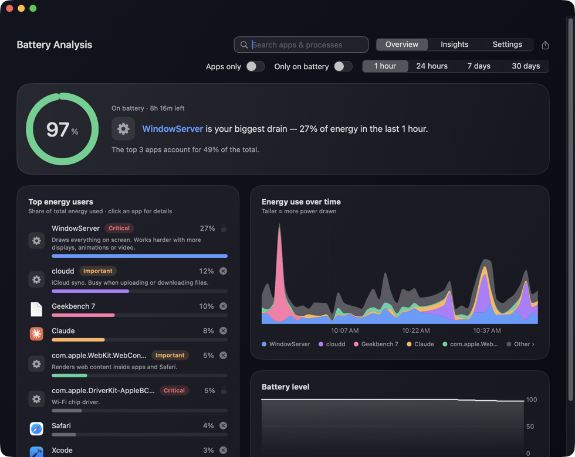
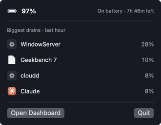

# Battery Analysis

A macOS menu bar app that tracks which apps and background processes use the most energy.

<p>
  
  
</p>

Activity Monitor shows energy use for the last 12 hours, but it lists system processes like `cloudd` or `mds_stores` with no explanation. Battery Analysis keeps 30 days of history and says what each of those processes does.

## What it does

- Ranks apps and processes by their share of energy use over the last hour, day, week or month. Helper processes such as "Chrome Helper" count toward their parent app.
- Gives each system process a one-line description and marks it Critical, Important or Optional, so you know whether it's safe to quit.
- Charts energy use over time and battery level. Click an app to see its own history and trend.
- Shows battery health (capacity, cycle count), a weekly summary, and how usage differs on battery vs. plugged in.
- Shows your Mac's current power draw next to the ⚡ in the menu bar.
- Suggests Low Power Mode when the battery is low and power draw is high, and turns the ⚡ yellow. You set the thresholds.
- Notifies you when one app is using most of your energy, or when the battery is low. Both are on by default and can be turned off in Settings.
- Lets you quit or force quit a process from the list, after confirming. The dialog says how many processes that covers. Processes macOS needs are locked.
- Search, filter to apps only or time on battery, and export to CSV.

It runs from the menu bar and only appears in the Dock while the dashboard is open.

## Requirements

macOS 14 or later
Xcode or the Swift 5.9+ toolchain to build.

Tested on Apple Silicon. An x86_64 build also works under Rosetta 2 on Apple Silicon, but I haven't tried it on a real Intel Mac, where the battery and power readings may differ.

## Build

```bash
git clone https://github.com/jadinnnnr/battery-analysis.git
cd battery-analysis
./build.sh --install
```

`./build.sh` on its own builds `BatteryAnalysis.app` in the project folder; `--install` also copies it to `/Applications`.

Run the tests with:

```bash
swift test
```

The app is ad-hoc signed and not notarized. A copy you build yourself opens normally. If you move a built copy to another Mac and macOS blocks it, go to System Settings › Privacy & Security and click Open Anyway.

## How it works

The app keeps one `top` process running in logging mode and reads each process's Energy Impact every 30 seconds. That's the same score Activity Monitor uses. It's a relative measure, not watts, so the percentages in the app are each process's share of the total.

The menu bar wattage comes from the Mac's system power sensor (SMC key `PSTR`), read every 5 seconds by default (2 and 10 are options). Macs without that sensor fall back to the battery's own reading, which macOS only refreshes about once a minute.

In testing on an Apple Silicon MacBook, the app used about 0.3% of one CPU core and its `top` process about another 0.3%. Updating the wattage every 2 seconds instead of 5 adds roughly 0.2%.

## Privacy

There's no network code, and the app never asks for administrator rights. It writes to:

- `~/Library/Application Support/BatteryAnalysis/`: usage history, deleted after 30 days
- `~/Library/Preferences/local.batteryanalysis.plist`: settings
- `~/Library/LaunchAgents/local.batteryanalysis.login.plist`: only if you turn on launch at login

It only stops a process when you confirm Quit or Force Quit, or tap "Quit it" on a notification. Notifications offer "Quit it" only for apps, which get a normal Quit request. It never changes Low Power Mode itself.

## Uninstall

Turn off launch at login in the Settings tab, quit from the ⚡ menu, and delete `/Applications/BatteryAnalysis.app`. To remove its data too:

```bash
rm -rf ~/Library/Application\ Support/BatteryAnalysis
```

```bash
defaults delete local.batteryanalysis
```

## Limitations

- Energy Impact is macOS's estimate, not a measurement of battery drain per app.
- Each sample covers the 80 heaviest processes, and the history keeps the top 12 apps per sample.
- 87 common system processes have written descriptions. The rest get a generic one.

## Code

| File | Contents |
|---|---|
| `App.swift` | Entry point, menu bar icon, Dock behavior |
| `Sampler.swift` | `top` stream, PID-to-app mapping, battery state |
| `LivePower.swift` | Wattage from the SMC power sensor |
| `Health.swift` | Battery health, Low Power Mode state |
| `Tracker.swift` | History storage and the main analysis |
| `Analytics.swift` | Per-app history, weekly summary, CSV export |
| `Views.swift` | Dashboard and menu bar popover |
| `Insights.swift` | Insights and Settings tabs |
| `Detail.swift` | Per-app detail view |
| `ProcessInfo.swift` | Process descriptions |
| `Killer.swift` | Quitting processes |
| `Alerts.swift` | Notifications |
| `Settings.swift` | Preferences, launch at login |
| `Models.swift` | Shared data types |

All in `Sources/BatteryAnalysis/`. Tests are in `Tests/BatteryAnalysisTests/`. `build.sh` packages and signs the app bundle.

## License

[MIT](LICENSE)
